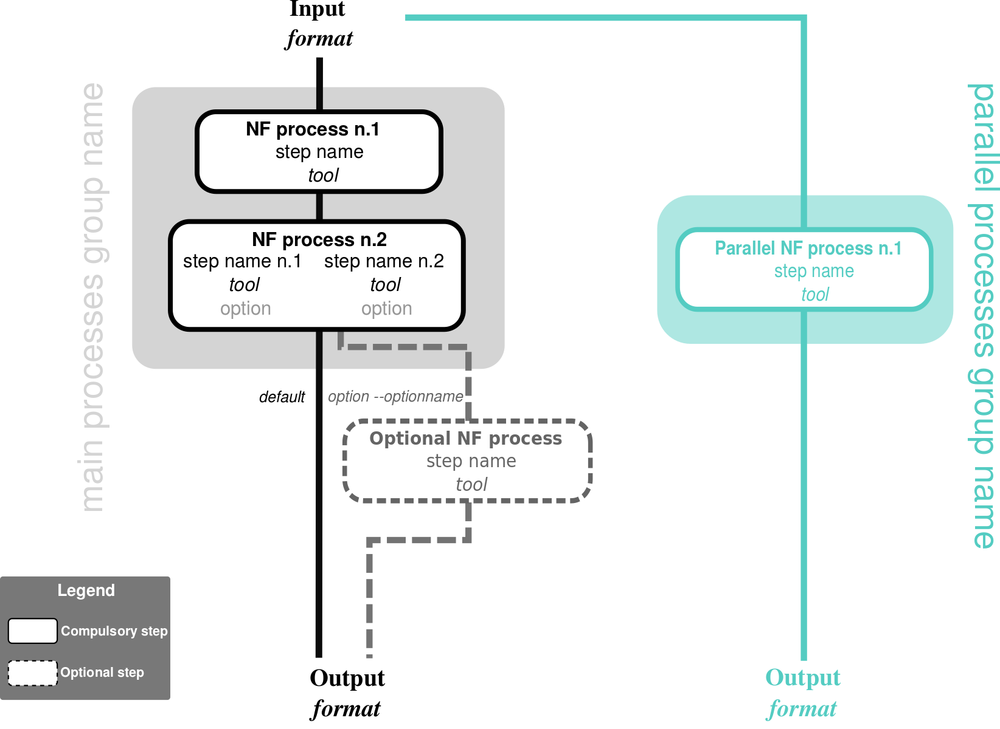
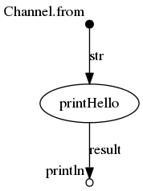

# SComatic-nf
## Empty template for nextflow pipelines (short description)

[](https://circleci.com/gh/IARCbioinfo/template-nf)
[](https://hub.docker.com/r/iarcbioinfo/template-nf/)
[](https://singularity-hub.org/collections/1404)
[](https://zenodo.org/badge/latestdoi/94193130)



## Description
Pipeline for detecting somatic single-nucleotide mutations in high-throughput single-cell genomics and transcriptomics data sets, such as single-cell RNA-seq and single-cell ATAC-se (using SComatic) and de novo extraction of mutational signatures (using SigProfilerExtractor).

Pipeline runs in following steps: <br>
&emsp; **Step1-4** : SComatic steps <br>
&emsp; **annovar** : annotated all variants using annovar <br>
&emsp; **preprocessing** : to create input for SigProfilerExtractor from SComatic output <br>
&emsp; **Step5_sigprofiler** :  de-novo extraction of mutational signatures using SigProfilerExtractor <br>


## Dependencies

1. This pipeline is based on [nextflow](https://www.nextflow.io). As we have several nextflow pipelines, we have centralized the common information in the [IARC-nf](https://github.com/IARCbioinfo/IARC-nf) repository. Please read it carefully as it contains essential information for the installation, basic usage and configuration of nextflow and our pipelines.
2. [SComatic](https://github.com/cortes-ciriano-lab/SComatic)
3. [annovar](https://annovar.openbioinformatics.org/en/latest/)
4. [SigProfilerExtractor](https://github.com/AlexandrovLab/SigProfilerExtractor)
   
You can avoid installing all the external software by only installing Docker. See the [IARC-nf](https://github.com/IARCbioinfo/IARC-nf) repository for more information.


## Input
  | Type      | Description     |
  |-----------|---------------|
  | --bam_folder    | Folder containing BAM files (*bai must be available in the same folder). |
  | --meta    | Metadata file mapping cell barcodes to cell type. |
  
## Parameters

  * #### Mandatory
| Name      | Example value | Description     |
|-----------|---------------|-----------------|
| --scomat_path    |            /Users/lipika/SComatic | Scomatic installation folder path |
| --ref    |            ref.fa | genome reference files (with index) |
| --annovar_path    |           /Users/lipika/annovar | path to annovar |
| --hdb    |            /Users/lipika/humandb | path to human database for annotation (refGene,cytoBand,exac03,avsnp147,dbnsfp30a,gnomad_genome- required)  |
| --hg_build    |            GRCh38 | genome build  |


  * #### Optional
| Name      | Default value | Description     |
|-----------|---------------|-----------------|
| --cpu   |            2 | Number of CPUs |
| --mem    |            20 | memory |
| --output_folder    |            SComatic-nf-results | Output folder |
| --nTrim    |            5 | Number of bases trimmed by setting the base quality to 0 at the beginning and end of each read |
| --maxNM   |            5 | Maximum number of mismatches permitted to consider reads for analysis |
| --maxNH    |            1 | Maximum number of alignment hits permitted to consider reads for analysis |
| --chrom    |            all | Chromosome to be analysed |
| --minbq    |            30 | Minimum base quality permited for the base counts |
| --nprocs    |            1 | Number of processes |
| --pon    |            30 | Panel of normals (PoN) file to be used to remove germline polymorphisms and recurrent artefacts |
| --min_signatures    |            1 | Minimum number of Mutational signatures |
| --max_signatures    |            10 | Maximum number of Mutational signatures |

  * #### Flags

Flags are special parameters without value.

| Name      | Description     |
|-----------|-----------------|
| --help    | Display help |


## Usage
annovar database files for hg38 could be downloaded using the command below (example shown for avsnp147)
```
perl path/to/annovar/annotate_variation.pl -buildver hg38 -downdb -webfrom annovar avsnp147 humandb/
```

 To use SComatic on your bamFile.bam, having metadata.tsv file mapping cell barcodes to cell type and reference genome ref.fa used in alignment fro hg38 genome build, use this command
  ```
  nextflow run iarcbioinfo/SComatic-nf --bam_folder bamFile.bam --meta metadata.tsv --ref ref.fa --scomat_path path/to/Scomatfolder --annovar_path path/to/annovar --hdb path/to/humandb --hg_build GRCh38
  ```

## Output
  | Type      | Description     |
  |-----------|---------------|
  | SplitBamCellTypes/sample.*.bam    | Folder containing cell-type-specific BAM files (step1 output)  |
  | Step2_BaseCellCounts/sample.*.tsv    | Folder containing base count information for each cell type and for every position in the genome (step2 output) |
  | Step3_BaseCellCountsMerged/sample.BaseCellCounts.AllCellTypes.tsv    | Folder containing merged base count file of all cell types. (step3 output)   |
  | Step4_VariantCalling/sample.calling.step*.tsv  (*=1,2)  | Folder containing two files files (1*.tsv: SNV called after applying filters for removing technical artefacts, 2*.tsv: Further filtered for RNA editing and PoN). (step4 output)   |
  | sigprofiler-input/sample_*.bam    | Folder containing input files for SigProfilerExtractor.  |
  | sigprofiler-results/*   | Folder containing result files and folders from [SigProfilerExtractor](https://osf.io/t6j7u/wiki/4.%20Using%20the%20Tool%20-%20Output/).  |
  
  


## Detailed description (optional section)
...

## Directed Acyclic Graph
[](http://htmlpreview.github.io/?https://github.com/IARCbioinfo/template-nf/blob/master/dag.html)

## Contributions

  | Name      | Email | Description     |
  |-----------|---------------|-----------------|
  | contrib1*    |            xx | Developer to contact for support (link to specific gitter chatroom) |
  | contrib2    |            xx | Developer |
  | contrib3    |            xx | Tester |

## References (optional)

## FAQ (optional)
